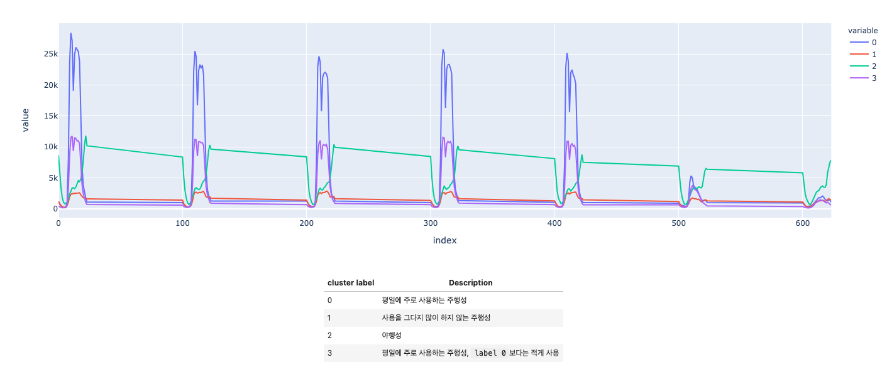

# Clickstream 데이터 전처리 개요
1. 시간 데이터 전처리
    - TIME_ID 사이트에 접속한 시간의 결측치 제거
    - TIME_ID 자료형을 datetime으로 변환
    - 각 데이터마다 시간, 요일, 월 컬럼 생성

2. 사이트 특성 처리
    - 사이트 별 사람들의 접속 순위를 10 분위로 나눈 컬럼생성    

3. 각 사람별 방문 횟수, 잔류 시간에 대해서 변수화
    - 사람 별 요일 별 단순 접속 횟수, 체류시간의 총합과 평균
    - 사람 별 월 별 단순 접속 횟수, 체류시간의 총합과 평균
    - 사람 별 10분위 사이트별 방문 횟수, 체류시간의 총합과 평균

# Clickstream 에서 논의한 점들
## 사람마다 검색 패턴이 어떻게 상이할까?
+ 직관적으로, 20대 남성의 경우에는 40대에 비해 밤에 인터넷을 사용할 것으로 기대되므로, 이러한 패턴을 통해 남녀 성별 및 나이를 예측할 수 있을 것으로 파악됨
+ 또한, 20대 여성의 경우에는 SNS, 카페를 자주 이용할 것으로 기대되며, 40대 남성의 경우에는 뉴스 및 경제 사이트를 자주 이용할 것으로 기대됨

따라서, 연령 및 남녀별로 인터넷 사용량 및 사이트 접속 패턴 등이 다를 것이라는 가정하에 변수 생성 및 데이터 분석 시행

## 접속 시간은 어떤 영향을 끼치는가?
### 월, 주별 사용 데이터
+ 각 성별마다 월별, 주별 인터넷 사용 기록이 다를 것으로 예상됨
+ 따라서 이에 대해 데이터를 구축
### 시간대 데이터를 사용하면 생기는 현상
+ 특히, 시간대 별로 나이 및 성별마다 인터넷 사용 시간이 다를 것으로 예상됨
+ 그러나, 00시부터 24시까지 모두 시간을 고려하기에는 너무 비효율적임
### 해결 방안: K-means Clustering
+ 데이터 패턴을 통해 비슷한 데이터끼리 군집화하는 비지도학습 머신러닝
+ 사람들의 시간대별 인터넷 사용 시간 총합을 기준으로 사람들의 행동 패턴을 학습시킴
+ 이 때 Elbow Method를 사용하여 군집 개수를 지정
    + Elbow Method는 클러스터가 증가함에 따라 클러스터의 '관성'이 변하는 그래프를 그렸을 때, 가장 경사가 완만해지는 지점을 클러스터 개수로 정하는 방법론
    + 이번 분석에서는 3 ~ 10까지의 클러스터에 대한 관성을 그렸으며, 최종으로 클러스터 개수가 4일 때 경사가 완만해진다고 간주되어 클러스터 개수를 4로 지정
### K-means Clustering 결과

+ 위의 클러스터 결과는 사람들의 분포를 설명하기 충분함
+ 그러나, 실제로 이런 클러스터링이 성별 및 나이를 제대로 설명하는지 판단하기 위해 cross tabulate 분석을 시행

### Cross tabulate 결과
| GROUP   |    0 |     1 |     2 |     3 |
|:--------|-----:|------:|------:|------:|
| F20-    | 3.73 | 58.09 | 13.28 | 24.9  |
| F30     | 7.16 | 56.73 |  9.74 | 26.36 |
| F40+    | 6.48 | 56.48 | 11.73 | 25.31 |
| M20-    | 6.44 | 59.23 | 10.3  | 24.03 |
| M30     | 5.08 | 55.9  | 13.77 | 25.25 |
| M40+    | 6.47 | 59.3  | 10.38 | 23.85 |

각각의 값은 그룹 별 군집 비율을 의미함
+ 각 GROUP 별 군집 비율이 서로 상이하지 않음 
+ time-based clustering을 통해 만든 변수가 엔트로피를 증가시키지 않음 
+ 따라서 의미 있는 변수로 보기 힘듦
+ 결국 시간대를 통한 클러스터링은 반려함

## 접속 사이트 및 카테고리는 어떻게 영향을 끼치는가?
### 사이트 관련 변수 
- 전체 데이터셋에서 한 번이라도 방문한 사이트가 약 37,000종류
- 그 외에도 접속한 사이트의 대분류, 중분류, 소분류 등이 있지만 비슷하게 새로운 카테고리가 나와 변수화를 시킬 수 없는 문제가 있음
- 또한 모든 카테고리에 대해 변수화를 시켰을 경우에 overfitting이 되는 등의 문제가 고려됨
- 따라서 방문한 사이트별 사람들의 총 `방문 빈도`를 기준으로 10분위로 나누어 대중적인 사이트와 그렇지 못한 사이트를 구별함

## 변수 생성 작업
1. 각 사람 별, 레이블 별마다 다음을 측정
    + 접속 횟수 총합
    + 접속 횟수 평균
    + 체류 시간 총합
    + 체류 시간 평균
2. 그 후, pivot table을 이용하여 사람만 index가 오고 나머지 레이블 별 통계량이 column으로 가게 데이터 셋을 구성